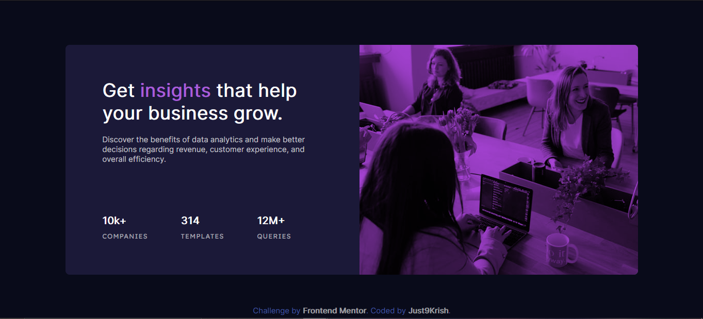

# Frontend Mentor - Stats preview card component solution

This is a solution to the [Stats preview card component solution](https://www.frontendmentor.io/challenges/stats-preview-card-component-8JqbgoU62).

## Table of contents

- [Overview](#overview)
  - [The challenge](#the-challenge)
  - [Screenshot](#screenshot)
  - [Links](#links)
- [My process](#my-process)
  - [Built with](#built-with)
  - [What I learned](#what-i-learned)
- [Author](#author)


## Overview

### The challenge

Users should be able to:

- View the optimal layout depending on their device's screen size

### Screenshot

[](solution-screenshot/desktop-preview.png)


### Links

- Solution URL: [FontEnd Mentor: My Solution](https://www.frontendmentor.io/challenges/stats-preview-card-component-8JqbgoU62/hub/stats-preview-card-bv7RX3abI)
- Live Site URL: [Netlify: Stats Preview Card](https://nifty-williams-b388c6.netlify.app/)


## My process

### Built with

- Semantic HTML5 markup
- CSS custom properties
- Flexbox

### What I learned

In this challenge I learned how to use Mix-Blend-Mode property, which I used to overlay image in this project.

```html
<div class="sideimg">
        <div class="overlay"></div>
      </div>
```
```css
.overlay{
    height: 100%;
    width: 100%;
    mix-blend-mode: multiply;
    background-color: #a743d6;
    border-top-right-radius: 8px;
    border-bottom-right-radius: 8px;
}
```

## Author

- Frontend Mentor - [@Just9krish](https://www.frontendmentor.io/profile/just9krish)
- Instagram - [@just9krish](https://www.Instagram.com/just9krish)
- Twitter - [@rvamit2648](https://www.twitter.com/rvamit2648)